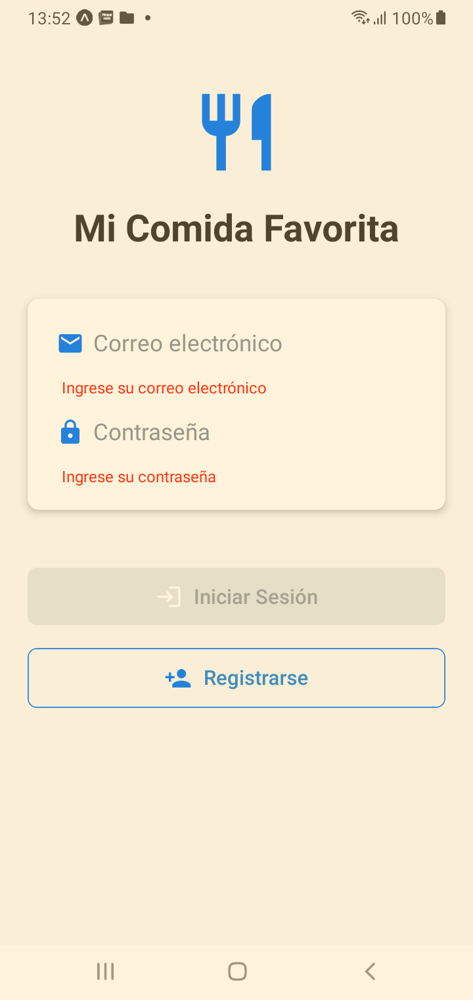
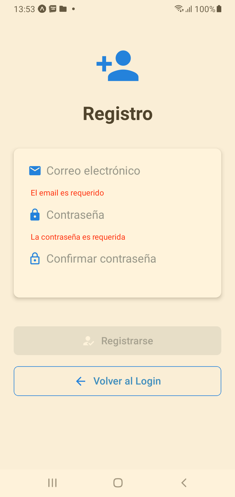
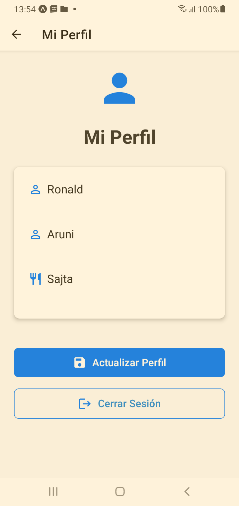

# Mi Comida Favorita

Una aplicación móvil desarrollada con React Native que permite a los usuarios gestionar su perfil y guardar su comida favorita.

## 📱 Características

- Autenticación de usuarios con Firebase
- Perfil de usuario personalizable
- Almacenamiento de datos en Firestore
- Interfaz de usuario moderna y responsiva

## 🚀 Instalación

1. Clona el repositorio:
```bash
https://github.com/fauni/MiComidaFavorita.git
cd MiComidaFavorita
```

2. Instala las dependencias:
```bash
npm install
```

3. Configura Firebase:
   - Crea un proyecto en Firebase Console
   - Habilita Authentication y Firestore
   - Descarga el archivo de configuración `google-services.json` (Android) o `GoogleService-Info.plist` (iOS)
   - Coloca el archivo en la ubicación correcta según tu plataforma

4. Inicia la aplicación utilizando expo:
```bash
npx expo start

```

## Descripcion de mejoras implementadas

A. LoginScreen.js
---
```javascript

    // Se agrego estados para validar los guardar los errores, validar el formulario y para manejar el estado del login
    const [formErrors, setFormErrors] = useState({});
    const [formValid, setFormValid] = useState(false);
    const [isLoading, setIsLoading] = useState(false);


    // Efecto para validar el formulario cuando cambian email o password en tiempo real 
    useEffect(() => {
        setFormValid(validateLoginForm());
    }, [email, password]);

    // Se agrego un método para manejar los errores que son retornados de firebas
    const getFirebaseErrorMessage = (errorCode) => {
        switch (errorCode) {
            case 'auth/invalid-credential':
                return 'Correo electrónico o contraseña incorrectos';
            default:
                return 'Error al iniciar sesión. Por favor, intente nuevamente';
        }
    };

    // Se agrego un metodo que se encarga de validar el formulario
    const validateLoginForm = () => {
        let errors = {};

        if (!email) errors.email = 'Ingrese su correo electrónico';
        else if (!/\S+@\S+\.\S+/.test(email)) errors.email = 'El email ingresado no es válido';

        if (!password) errors.password = 'Ingrese su contraseña';
        else if (password.length < 8) errors.password = 'La contraseña debe tener al menos 8 caracteres';

        setFormErrors(errors);
        return Object.keys(errors).length === 0;
    };

    /**
     * Maneja el proceso de inicio de sesión con Firebase
     * Realiza la validación del formulario y la autenticación
     */
    const handleLogin = async () => {
        setIsLoading(true);
        if (validateLoginForm()) {
            try {
                await signInWithEmailAndPassword(auth, email, password);
                navigation.replace("Home");
            } catch (error) {
                const errorMessage = getFirebaseErrorMessage(error.code);
                setError(errorMessage);
            } finally {
                setIsLoading(false);
            }
        } else {
            setIsLoading(false);
        }
    }

    // Para el renderizado se maneja la condición del Loading.
    return isLoading ? (
        <View style={styles.container}>
            <ActivityIndicator size="large" color="#007bff" />
        </View>
    ) : (
```

B. RegisterScreen.js
---
```javascript

    // Se agrego estados para validar los campos en el formulario
    // Se agrego estados para manejar el loading states
    const [formErrors, setFormErrors] = useState({});
    const [formValid, setFormValid] = useState(false);
    const [isLoading, setIsLoading] = useState(false);
    

    // Efecto para validar el formulario cada vez que cambian los campos, esto permite validar en tiempo real
    useEffect(() => {
        setFormValid(validateForm());
    }, [email, password, confirmPassword]);

    /**
     * Valida que la contraseña cumpla con los requisitos de seguridad
     * @param {string} password - La contraseña a validar
     * @returns {boolean} - true si la contraseña cumple con los requisitos
     */
    const validatePassword = (password) => {
        const passwordRegex = /^(?=.*[a-z])(?=.*[A-Z])(?=.*\d)(?=.*[@$!%*?&])[A-Za-z\d@$!%*?&]{8,}$/;
        return passwordRegex.test(password);
    };

    /**
     * Valida todos los campos del formulario y establece los errores correspondientes
     * @returns {boolean} - true si el formulario es válido
     */
    const validateForm = () => {
        let errors = {};

        if (!email) errors.email = 'El email es requerido';
        else if (!/\S+@\S+\.\S+/.test(email)) errors.email = 'El email no es válido';

        if (!password) errors.password = 'La contraseña es requerida';
        else if (!validatePassword(password)) {
            errors.password = 'Debe tener al menos 8 caracteres, mayúscula, minúscula, número y símbolo';
        }

        if (password !== confirmPassword) {
            errors.confirmPassword = 'Las contraseñas no coinciden';
        }

        setFormErrors(errors);
        return Object.keys(errors).length === 0;
    };

    /**
     * Maneja el proceso de registro del usuario
     * Crea una nueva cuenta en Firebase Authentication
     */
    const handleRegister = async () => {
        setIsLoading(true);
        if (validateForm()) {
            try {
                await createUserWithEmailAndPassword(auth, email, password);
                navigation.replace('Home');
            } catch (error) {
                setError('Error al registrarse: ' + error.message);
            } finally {
                setIsLoading(false);
            }
        }
    };

    // Muestra un indicador de carga mientras se procesa el registro
    if (isLoading) {
        return (
            <View style={styles.container}>
                <ActivityIndicator size="large" color="#007bff" />
            </View>
        );
    }
```

C. HomeScreen.js
---
```javascript
    // Estado para controlar el indicador de carga
    const [isLoading, setIsLoading] = useState(false);

    // Función para cargar el perfil del usuario desde Firestore, ademas se agrego el metodo para controlar el indicador de carga al iniciar el proceso y al finalizar mediante finally
    const loadProfile = async () => {
        setIsLoading(true);
        try {
            const docRef = doc(db, 'usuarios', auth.currentUser.uid);
            const docSnap = await getDoc(docRef);

            if (docSnap.exists()) {
                setProfile(docSnap.data());
            } else {
                console.log('No existe un perfil para este usuario');
            }
        } catch (error) {
            console.error('Error al cargar el perfil:', error);
        } finally {
            setIsLoading(false);
        }
    };

    // Función para actualizar el perfil del usuario en Firestore, y se agrego el manejador de carga
    const handleUpdate = async () => {
        setIsLoading(true);
        try {
            const docRef = doc(db, 'usuarios', auth.currentUser.uid);
            await setDoc(docRef, profile);
            console.log('Perfil actualizado correctamente');
        } catch (error) {
            console.error('Error al actualizar el perfil:', error);
            alert('Error al actualizar el perfil');
        } finally {
            setIsLoading(false);
        }       
    };

    // Renderizado condicional basado en el estado de carga
    return isLoading ? (
        <View style={styles.container}>
            <ActivityIndicator size="large" color="#007bff" />
        </View>
    ) : (
        <ScrollView style={styles.scrollView}>
    
```

## 📸 Screenshots






## 🔧 Configuración del Entorno de Desarrollo

### Requisitos Previos

- Node.js (versión 14 o superior)
- npm o yarn
- Android Studio (para desarrollo en Android)
- Xcode (para desarrollo en iOS, solo macOS)
- Cuenta de Firebase

## 📧 Contacto

Franz Ronald Aruni - amrfranz@gmail.com
